# opentransit-mobile

Open-source, multi-city, multimodal public-transport trip planner for iOS and
Android. Part of the **opentransit** project together with
[`opentransit-api`](https://github.com/jeronimotech/opentransit-api) (FastAPI + OpenTripPlanner) and
[`opentransit-web`](https://github.com/jeronimotech/opentransit-web) (Next.js). First city: **Bogotá**
(TransMilenio / SITP, GTFS + GTFS-Realtime).

Flutter 3.41 · Dart 3.11 · MapLibre · Riverpod · go_router · MIT.

| Home hub | Ubica tu bus | Results (sorted) | Itinerary + fare | Stop board |
|---|---|---|---|---|
| 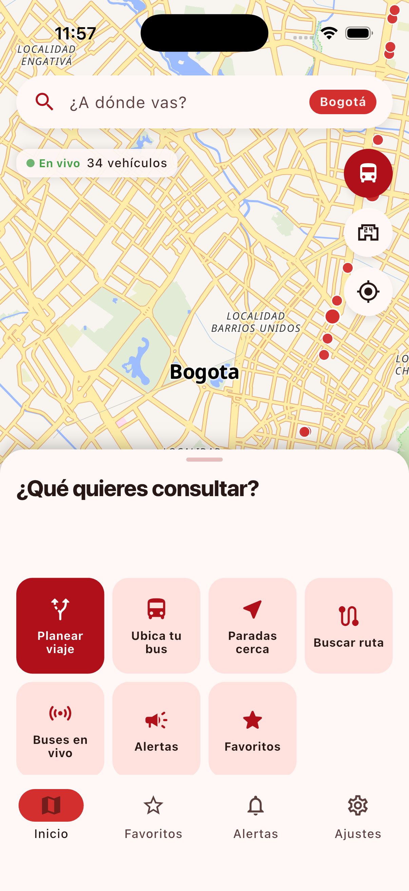 |  | 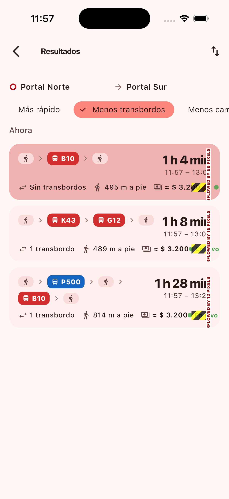 | 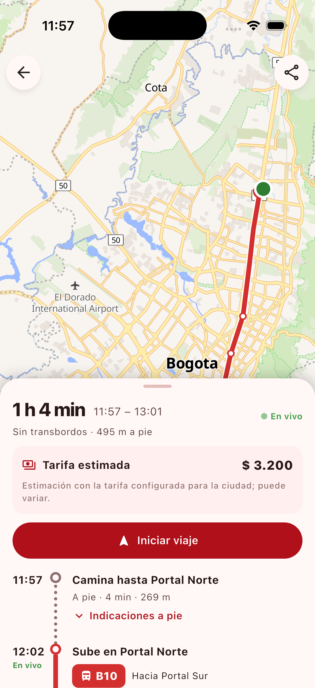 | 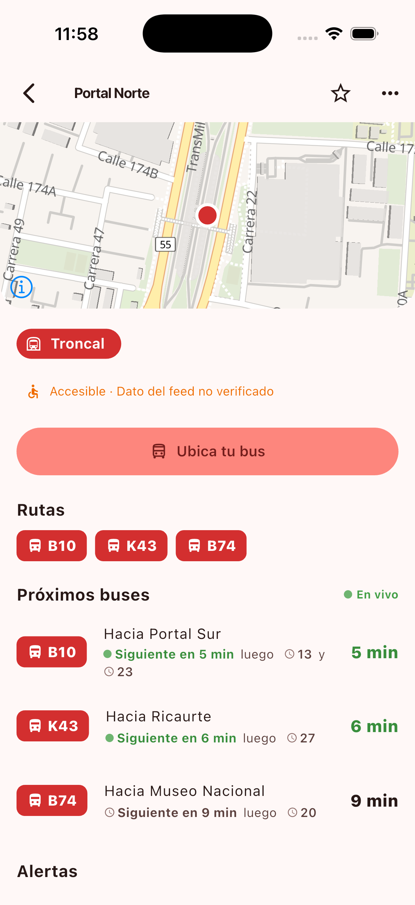 |

| Favorites | Alerts | Dark mode + POIs | Forced update |
|---|---|---|---|
| 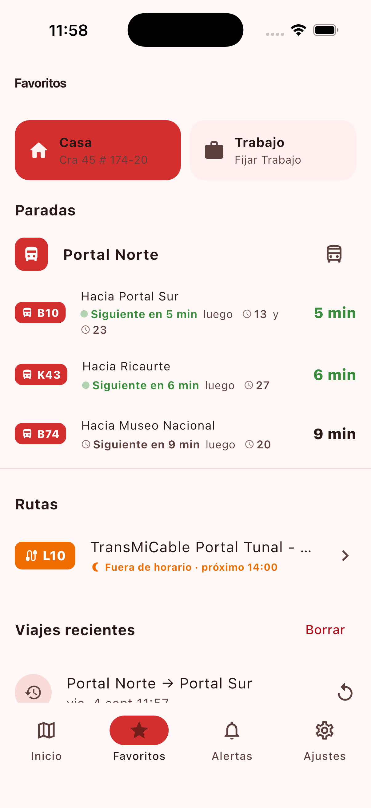 | 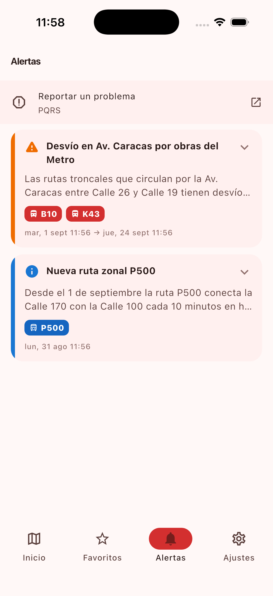 | 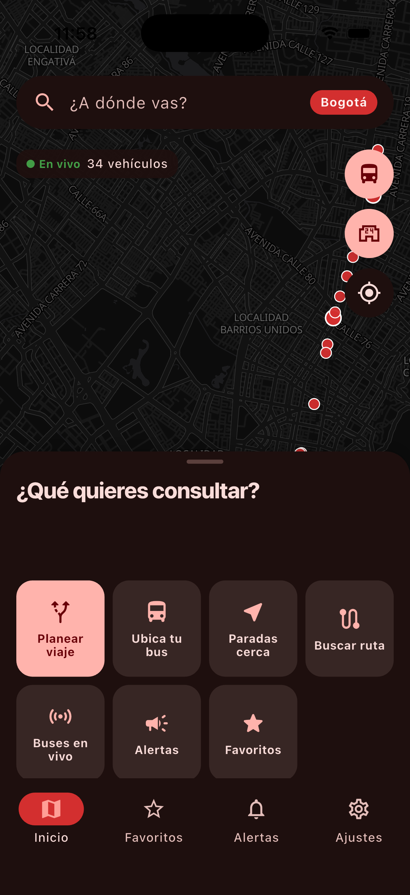 | 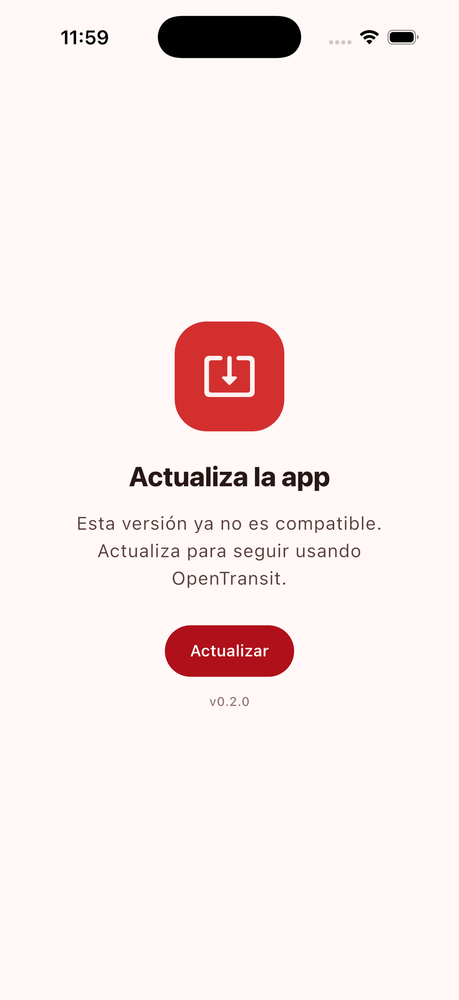 |

More: [city picker](docs/screenshots/01_city_picker.png) · [plan form](docs/screenshots/04_plan_form.png) · [route detail](docs/screenshots/08_route_detail.png) · [v1 screens](docs/screenshots/v1/)

Against the real Bogotá API (`opentransit-api` on port 8001, live GTFS-RT, ~5,800 buses):

| Live home hub + fleet | Live results | Live itinerary | Live station board | Live "Ubica tu bus" |
|---|---|---|---|---|
|  | 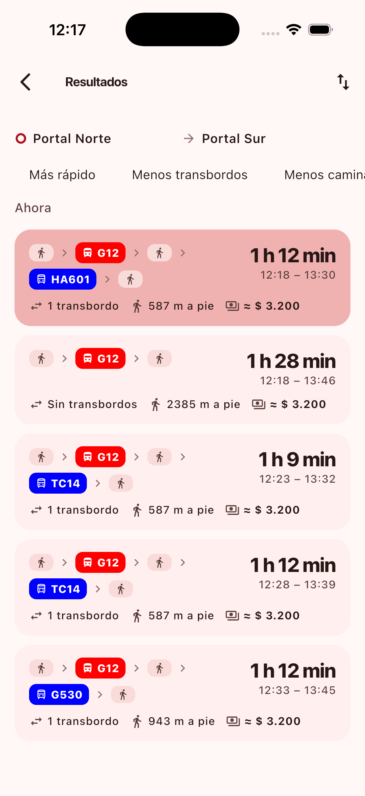 | 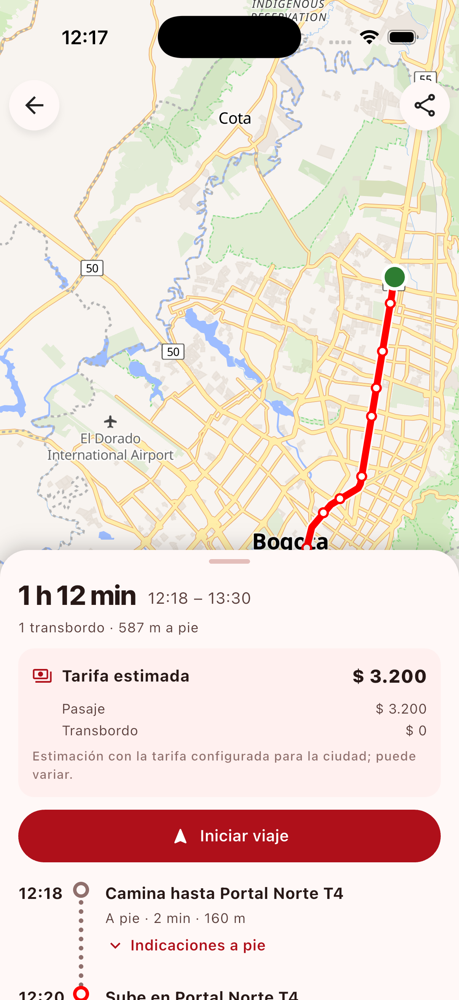 | 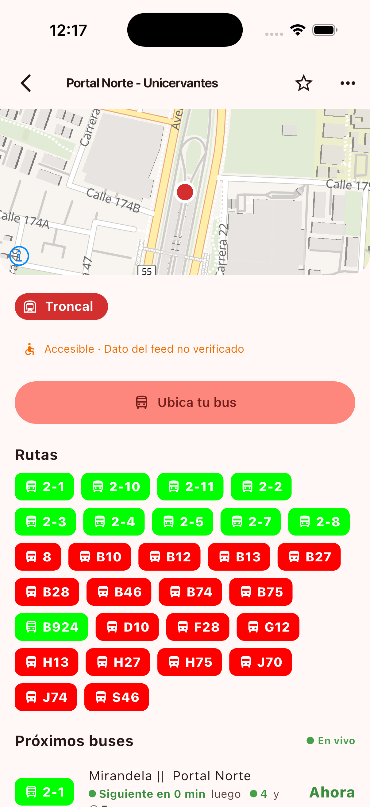 | 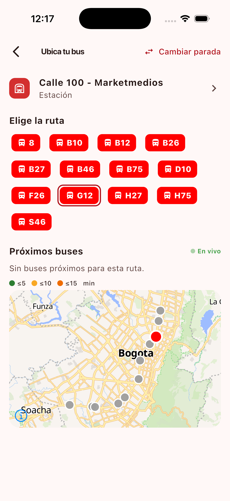 |

## What it does

**v1.1 — the best of TransMi App and Maas, on open data** (see the plan in the
workspace `ROADMAP-v1.1.md`):

- **Question-led home hub** — "¿Qué quieres consultar?" tiles (Planear viaje ·
  Ubica tu bus · Paradas cerca · Buscar ruta · Buses en vivo · Alertas ·
  Favoritos) over a "Estaciones y paradas cerca" card, an alert carousel
  (severity-sorted, dismissible, max 3 impressions per alert) and the city's
  partner hand-off tiles (`services[]`: recharge, PQRS…).
- **Ubica tu bus** — station → route chips → next buses labelled **En vivo /
  Por programación / Estimado**, stops away and distance, with the route's
  buses drawn on a map tinted by ETA bucket (≤5 · ≤10 · ≤15 min).
- **Arrival board** on every stop — grouped by route: "Siguiente en 5 min ·
  luego 10, 15 y 20", live/scheduled badge per time, auto-refresh from the
  city's `config.departuresRefreshSeconds`. Works against older APIs too (the
  client groups the flat departures list itself).
- **Freshness everywhere** — "En vivo" · "Programado" · "Sin datos en vivo
  hace N s", from `/health` and per-response `freshness`.
- **Live buses** coloured by component, culled to the viewport and
  **interpolated** between SSE frames (10 Hz ticker, eased) so they glide
  instead of jumping.
- **Service hours** — "Fuera de horario · próximo 04:30" on routes, boards and
  favorites, from `RouteRef.serviceWindow`.
- **Tarifa estimada** — the API's fare, or a client estimate from
  `city.fares` (base, transfer, window, max transfers) with a breakdown;
  always marked as estimated.
- **Sorting chips** — Más rápido · Menos transbordos · Menos caminata · Más
  económico · Salida más próxima.
- **Component icons & colours** from `city.components[]` (Troncal, Alimentador,
  Dual, Zonal, TransMiCable…), no hard-coded palette.
- **Typed favorites** — Casa / Trabajo / custom icon; stops show their live
  board and routes their service hours right on the favorites screen; the last
  10 trips are kept for one-tap replanning.
- **Remote config** — forced-update and maintenance screens
  (`config.minAppVersion`, `config.maintenance`), feature flags that hide
  modules, poll intervals.
- **Deep links** — custom scheme plus **App Links / Universal Links** for the
  canonical `https://<web-host>/{city}/...` URLs; sharing emits those URLs.
- **Iniciar viaje** — follow-along mode: current leg highlighted, progress,
  and a local "Próxima parada es la tuya" notification when you are within
  ~300 m of your alighting stop (foreground location only, no backend).
- **Station services layer** — bike parking, toilets, ATMs, health points and
  libraries from `/pois` (OSM), toggleable on the map.
- **Honest accessibility** — the feed's blanket "accessible" flag is shown as
  *no verificado* with its source; real verification comes from the API.
- **Nearby-first search**, **Llegar en bici a la estación** (BICYCLE + TRANSIT)
  and **PQRS hand-off** links (never an in-app reporter).

Plus everything from v1: city picker, map with nearby stops, planner with
geocode autocomplete and my-location, itinerary detail with coloured legs and
walking steps, route detail with live buses, vehicle detail, alerts, settings
(city, es/en, theme, accessibility, walking distance), offline-safe error
states.

## Quickstart

```bash
flutter pub get
flutter gen-l10n                       # generates lib/l10n/generated

# Demo mode with bundled fixtures (no backend needed)
flutter run --dart-define=MOCK=true

# Against a local opentransit-api
flutter run --dart-define=API_URL=http://localhost:8001        # iOS simulator
flutter run --dart-define=API_URL=http://10.0.2.2:8001         # Android emulator
```

Without `API_URL` the app defaults to `http://localhost:8001` on iOS and
`http://10.0.2.2:8001` on Android.

### `--dart-define` options

| define | default | purpose |
|---|---|---|
| `MOCK` | `false` | use `assets/fixtures/*.json` instead of the network |
| `API_URL` | platform default above | base URL of opentransit-api |
| `WEB_HOST` | `opentransit.example.org` | host of the web app whose `https://` URLs this app claims and shares |
| `MAP_STYLE` | `https://tiles.openfreemap.org/styles/liberty` | MapLibre style (light) |
| `MAP_STYLE_DARK` | `https://tiles.openfreemap.org/styles/dark` | MapLibre style (dark) |

### Verify

```bash
flutter analyze --fatal-infos
flutter test                                         # 70 unit + widget tests
tool/screenshots.sh                                  # iOS simulator walkthrough (mock) → docs/screenshots/
tool/screenshots.sh "" integration_test/forced_update_test.dart   # forced-update screen
tool/screenshots.sh "" integration_test/live_api_test.dart \
  --dart-define=API_URL=http://localhost:8001        # same, against a running API
```

## Mock mode

`MockApiClient` implements the same `ApiClient` interface as the HTTP client and
serves the JSON under `assets/fixtures/` (Bogotá + a Medellín stub, three
itineraries Portal Norte → Portal Sur with estimated fares, stops with boards,
next buses, ~30 vehicles that move along their routes every 4 s, alerts, POIs,
geocode results, health). Timestamps are shifted so they are always "around
now". Regenerate with `python3 tool/gen_fixtures.py` if you change the shapes.

## Project layout

```
lib/
  main.dart, app.dart, router.dart          bootstrap, MaterialApp.router (+ ConfigGate), routes
  core/
    config.dart                             dart-defines (API_URL, MOCK, WEB_HOST, map styles)
    api/       api_client.dart (interface) · http_api_client.dart (dio, v1.1 fallbacks) · mock_api_client.dart · sse.dart
    models/    city (components, fares, config, links, services) · plan · transit (serviceWindow, accessibility) · live (board, next, pois, health) · vehicle
    live/      interpolation.dart            eased vehicle interpolation between frames
    providers.dart                          Riverpod: settings, cities, health, favorites, recents, alert impressions, boards, next buses, pois, live stream
    storage/   preferences · favorites (typed favorites, recent trips, alert impressions)
    theme/     app_theme.dart               Material 3 seeded from the city colour
    utils/     fare · service_window · eta · version · links (canonical https) · notifications · polyline · geo · colors · format · location
    widgets/   transit_map.dart (MapLibre + GeoJSON overlays incl. POIs) · common.dart (RouteChip, ComponentBadge, FreshnessLabel, ServiceHint, FareText…)
  features/
    home/ (hub tiles, alert carousel) · locate/ (Ubica tu bus) · planner/ (plan, results + sorting, itinerary + fare, follow-along)
    stops/ (board) · routes/ (list, detail) · live/ · alerts/ · favorites/ (typed, save sheet) · settings/ · config/ (gate) · cities/
  l10n/       app_es.arb (source) · app_en.arb · generated/
assets/fixtures/                            mock data
integration_test/                           screenshots_test · forced_update_test · live_api_test (cues for tool/screenshots.sh)
test/                                       unit + widget tests
```

## API contract

The app consumes `opentransit-api` v1/v1.1 (`/v1/cities/{city}/…`). Ids for
stops, routes and trips are opaque, feed-scoped strings (`bogota:1234`). Times
are ISO-8601 with offset and are displayed in the device's local time. The
Dart models in `lib/core/models/` mirror the contract field by field; every
v1.1 field is optional so the app keeps working against a v1 API (boards are
grouped client-side, fares estimated from city parameters when present).

## Adding a city

Nothing changes in this repo. When `opentransit-api` lists a new city in
`GET /v1/cities`, it shows up in the picker with its own colour, modes,
bounding box, component palette, fare parameters, feature flags, links and
partner tiles. Screens hide what a city does not support.

## Deep links

Custom scheme:
`opentransit://{city}/plan?fromLat=4.75&fromLon=-74.04&toLat=4.59&toLon=-74.16&fromName=Portal%20Norte&toName=Portal%20Sur[&time=ISO][&arriveBy=true]`,
`opentransit://{city}/stops/{stopId}`, `.../routes/{routeId}`, `.../locate?stop=&route=`, `.../alerts`.

Canonical web URLs (`https://<WEB_HOST>/{city}/...`) open in the app too. The
placeholder host `opentransit.example.org` lives in
`android/app/src/main/AndroidManifest.xml` (App Links intent filter) and
`ios/Runner/Runner.entitlements` (associated domains); replace it with the
deployed web host, keep the `WEB_HOST` dart-define in sync, and publish
`/.well-known/assetlinks.json` and `apple-app-site-association` on that host.

## Contributing

See [CONTRIBUTING.md](CONTRIBUTING.md). Data attribution for Bogotá:
TRANSMILENIO S.A. (GTFS / GTFS-RT). Map: © OpenMapTiles © OpenStreetMap
contributors, tiles by OpenFreeMap. POIs: © OpenStreetMap contributors.
