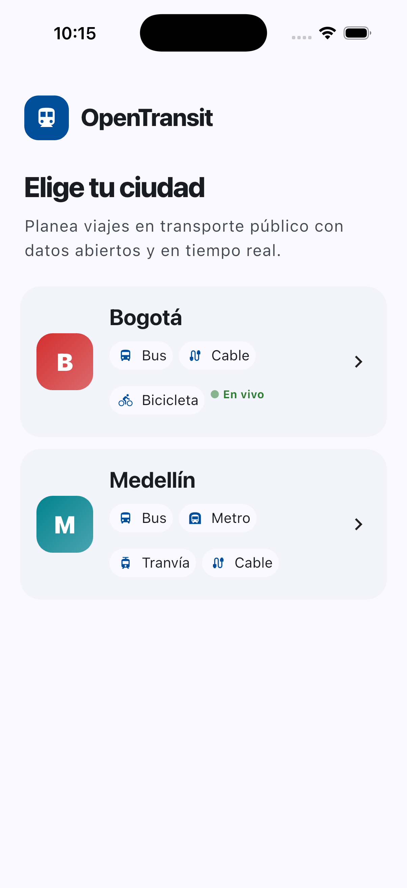
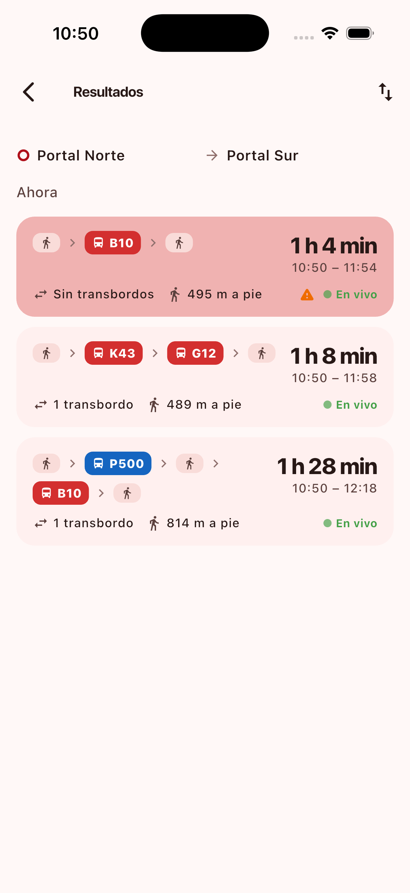
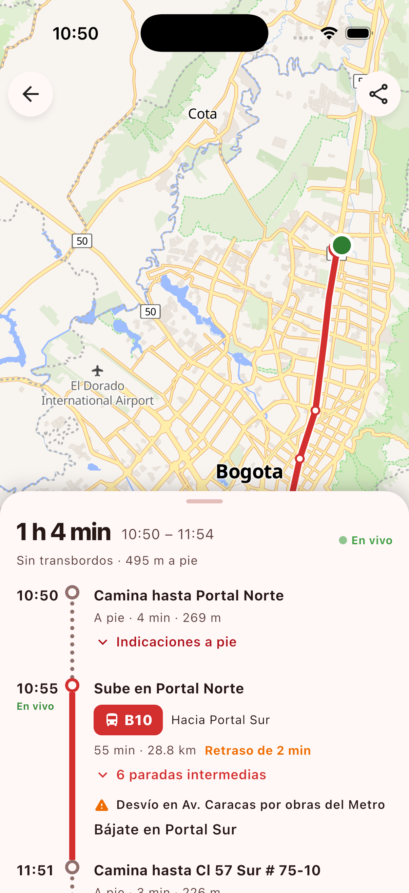
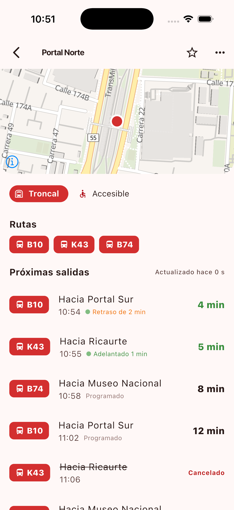

# opentransit-mobile

Open-source, multi-city, multimodal public-transport trip planner for iOS and
Android. Part of the **opentransit** project together with
[`opentransit-api`](../opentransit-api) (FastAPI + OpenTripPlanner) and
[`opentransit-web`](../opentransit-web) (Next.js). First city: **Bogotá**
(TransMilenio / SITP, GTFS + GTFS-Realtime).

Flutter 3.41 · Dart 3.11 · MapLibre · Riverpod · go_router · MIT.

| City picker | Home map + live fleet | Results | Itinerary | Stop |
|---|---|---|---|---|
|  |  |  |  |  |

More: [plan form](docs/screenshots/03_plan_form.png) · [route detail](docs/screenshots/07_route_detail.png) · [alerts](docs/screenshots/08_alerts.png) · [dark mode](docs/screenshots/09_home_dark.png)

## What it does (v1)

- **City picker** on first launch, remembered; every screen is scoped to `/{city}`.
- **Home map** (OpenFreeMap vector tiles, no API key) with nearby stops that
  follow the camera, a **live vehicles** layer fed by the API's SSE stream
  (full frame + deltas), search bar, my-location, long-press to set a point.
- **Trip planner**: origin/destination with geocode autocomplete (GTFS stops +
  Photon), "my location", depart-at / arrive-by, mode chips, wheelchair.
- **Results** as cards (duration, times, transfers, walk, coloured route chips,
  live badge, alert icon) and an **itinerary detail** with map (coloured legs,
  dashed walking, boarding/alighting stops) plus a timeline with walking steps,
  intermediate stops, delays and alerts. Share as an `opentransit://` deep link.
- **Stop detail** with departures auto-refreshing every 20 s (countdown, live /
  scheduled / cancelled, delay), routes serving the stop, relevant alerts.
- **Route detail** with pattern on the map, direction switch, live vehicles on
  that route, ordered stop list.
- **Vehicle detail** (tap a bus): route, headsign, next stop + ETA, delay,
  speed, occupancy, recent trail.
- **Alerts**, **favorites** (stops, routes, places; stored on device),
  **settings** (city, language es/en, theme, accessibility, walking distance,
  live layer toggle).
- Graceful error/offline states everywhere; the app never crashes when the API
  is down.

## Quickstart

```bash
flutter pub get
flutter gen-l10n                       # generates lib/l10n/generated

# Demo mode with bundled fixtures (no backend needed)
flutter run --dart-define=MOCK=true

# Against a local opentransit-api
flutter run --dart-define=API_URL=http://localhost:8001        # iOS simulator
flutter run --dart-define=API_URL=http://10.0.2.2:8001         # Android emulator
```

Without `API_URL` the app defaults to `http://localhost:8001` on iOS and
`http://10.0.2.2:8001` on Android.

### `--dart-define` options

| define | default | purpose |
|---|---|---|
| `MOCK` | `false` | use `assets/fixtures/*.json` instead of the network |
| `API_URL` | platform default above | base URL of opentransit-api |
| `MAP_STYLE` | `https://tiles.openfreemap.org/styles/liberty` | MapLibre style (light) |
| `MAP_STYLE_DARK` | `https://tiles.openfreemap.org/styles/dark` | MapLibre style (dark) |

### Verify

```bash
flutter analyze --fatal-infos
flutter test
tool/screenshots.sh            # iOS simulator walkthrough → docs/screenshots/
```

## Mock mode

`MockApiClient` implements the same `ApiClient` interface as the HTTP client and
serves the JSON under `assets/fixtures/` (Bogotá + a Medellín stub, three
itineraries Portal Norte → Portal Sur, stops, departures, ~30 vehicles that
move along their routes every 4 s, alerts, geocode results). Timestamps in the
fixtures are shifted so they are always "around now". Regenerate the fixtures
with `python3 tool/gen_fixtures.py` if you change the shapes.

## Project layout

```
lib/
  main.dart, app.dart, router.dart          bootstrap, MaterialApp.router, routes
  core/
    config.dart                             dart-defines
    api/       api_client.dart (interface) · http_api_client.dart (dio) · mock_api_client.dart · sse.dart
    models/    city · plan (Place, Leg, Itinerary, PlanRequest, GeocodeResult) · transit (RouteRef, Stop, Departure, RouteDetail, TransitAlert) · vehicle
    providers.dart                          Riverpod providers (settings, cities, favorites, data, live stream)
    storage/   preferences.dart · favorites.dart
    theme/     app_theme.dart               Material 3 seeded from the city colour
    utils/     polyline · geo · colors · format · location
    widgets/   transit_map.dart (MapLibre + GeoJSON overlays) · common.dart (RouteChip, LiveBadge, ErrorView…)
  features/
    cities/ home/ planner/ stops/ routes/ live/ alerts/ favorites/ settings/
  l10n/       app_es.arb (source) · app_en.arb · generated/
assets/fixtures/                            mock data
integration_test/screenshots_test.dart      screen walkthrough used by tool/screenshots.sh
test/                                       unit + widget tests
```

## API contract

The app consumes `opentransit-api` v1 (`/v1/cities/{city}/…`). Ids for stops,
routes and trips are opaque, feed-scoped strings (`bogota:1234`). Times are
ISO-8601 with offset and are displayed in the device's local time. See the
`docs/api-contract.md` in the API repo for the full schema; the Dart models in
`lib/core/models/` mirror it field by field.

## Adding a city

Nothing changes in this repo. When `opentransit-api` lists a new city in
`GET /v1/cities`, it shows up in the picker with its own colour, modes, bounding
box and feature flags (`realtimeVehicles`, `tripUpdates`, `alerts`, `fares`).
Screens hide what a city does not support (e.g. the live layer toggle).

## Deep links

`opentransit://{city}/plan?fromLat=4.75&fromLon=-74.04&toLat=4.59&toLon=-74.16&fromName=Portal%20Norte&toName=Portal%20Sur[&time=ISO][&arriveBy=true]`

Also `opentransit://{city}/stops/{stopId}`, `.../routes/{routeId}`, `.../alerts`.
The scheme is registered in `ios/Runner/Info.plist` and
`android/app/src/main/AndroidManifest.xml`.

## Contributing

See [CONTRIBUTING.md](CONTRIBUTING.md). Data attribution for Bogotá:
TRANSMILENIO S.A. (GTFS / GTFS-RT). Map: © OpenMapTiles © OpenStreetMap
contributors, tiles by OpenFreeMap.
